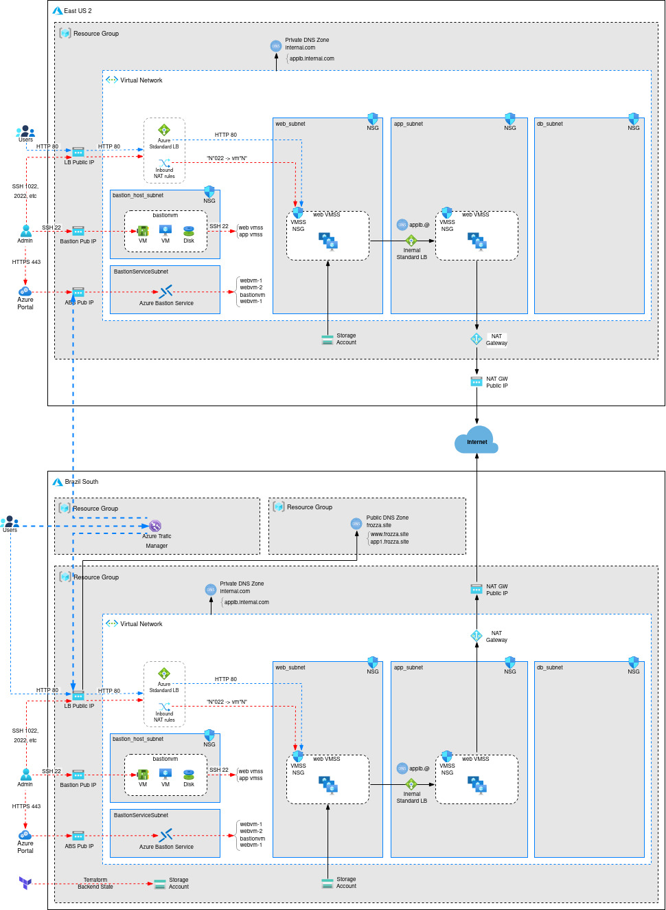

# azure-4tier-IaC-terraform
Explore Terraform on Azure by building a 4-Tier network system design with 20+ Azure Services and 30+ Terraform concepts.

# Terraform on Azure with IaC DevOps and SRE

## Azure Services
01. Resource Group
02. Virtual Network
03. Subnets
04. Network Security Groups
05. Virtual Machines
06. Network Interfaces
07. Public IPs
08. Load Balancer - Internet and Internal
09. Traffic Manager
11. Virtual Machine Scale Sets 
12. Autoscaling
13. Private DNS Zones
14. Public DNS Zones
15. Application Gateway
16. Storage Accounts
17. Azure DevOps - Build Pipelines
18. Azure DevOps - Release Pipelines
19. Azure MySQL Single Server
20. Azure NAT Gateway 

## Terraform Concepts covered
01. Settings Block
02. Providers Block
03. Multiple Providers usage
04. Dependency Lock File Importance
05. Resources Syntax and Behavior
06. Resources Meta-Argument - depends_on
07. Resources Meta-Argument - count
08. Resources Meta-Argument - for_each
09. Resources Meta-Argument - lifecycle
10. Input Variables - Basics
11. Input Variables - Assign When Prompted
12. Input Variables - Assign with terraform.tfvars
13. Input Variables - Assign with tfvars var-file argument
14. Input Variables - Assign with auto tfvars
15. Input Variables - Lists
16. Input Variables - Maps
17. Input Variables - Sensitive Input Variables
18. File Function
19. Output Values
20. Local Values
21. Datasources
22. Backends - Remote State Storage
23. File Provisioner
24. remote-exec Provisioner
25. Null Resource
26. Modules from Public Registry
27. Build Local Module
28. Dynamic Blocks
29. base64encode function
30. filebase64 function
31. element function
32. lookup function
33. Remote State Datasource

## What will students learn in your course?
- To master Terraform in a Real-world perspective with 25 demo's on Azure Cloud with 20+ Azure Services and 30+ Terraform Concepts
- Build Azure Virtual Network 4-Tier design with Subnets and Network Security Groups
- Build infrastructure incrementally on Azure Cloud from simple VM to complex designs like load balancing across regions using Azure Traffic Manager with Terraform
- Build Standard Load Balancer External and Internal with Inbound NAT Rules using Terraform
- Build Virtual Machine Scale Sets Manual and Autoscaling Profile concepts like default, recurrence and Fixed Time profiles with Terraform
- Build Azure Public and Private DNS Zones using Terraform
- You will implement IaC DevOps usecase using Azure DevOps Build and Release Pipleines for your Terraform Configurations 
- You will build Azure Application Gateway usecases like Context Path Routing, Mutlsite Hosting, SSL, HTTP to HTTPS Redirect and AG Error Pages
- You will build a DNS to DB usecase with Azure MySQL Single Server with Virtual Network Rules and Service Endpoint concepts in Azure
- You will learn in detail about Terrafrom State, Local and Remote Backends. 
- You will learn and implement all Terraform Provisioners 
- You will learn and implement Terraform Modules with 2 types (Public Modules and Local Modules) and also publish a module to Terraform Public Registry
- You will implement Terraform Remote State Datasource concept for Load balancing across regions using Azure Traffic Manager and Azure Standard Load Balancer

- From Azure cloud perspective, also for complex topics like Standard Load Balancer, Application Gateway, Virtual Machine Scale Sets, we first implemnt via Azure Portal and then automate them via Terraform. 

## Who are your target students?
- Infrastructure Architects or Sysadmins or Developers who are planning to master Terraform from Real-World perspective on Azure Cloud
- Any beginner who is interested in learning IaC Infrastructure as Code current trending tool Terraform 
- Anyone who want to implement IaC DevOps on Azure DevOps using Build and Release Pipelines

## Additional References
- [Certification Curriculum](https://www.hashicorp.com/certification/terraform-associate)
- [Certification Preparation](https://learn.hashicorp.com/collections/terraform/certification)
- [Study Guide](https://learn.hashicorp.com/tutorials/terraform/associate-study?in=terraform/certification)
- [Exam Review Guide](https://learn.hashicorp.com/tutorials/terraform/associate-review?in=terraform/certification)
- [Sample Questions](https://learn.hashicorp.com/tutorials/terraform/associate-questions?in=terraform/certification)
